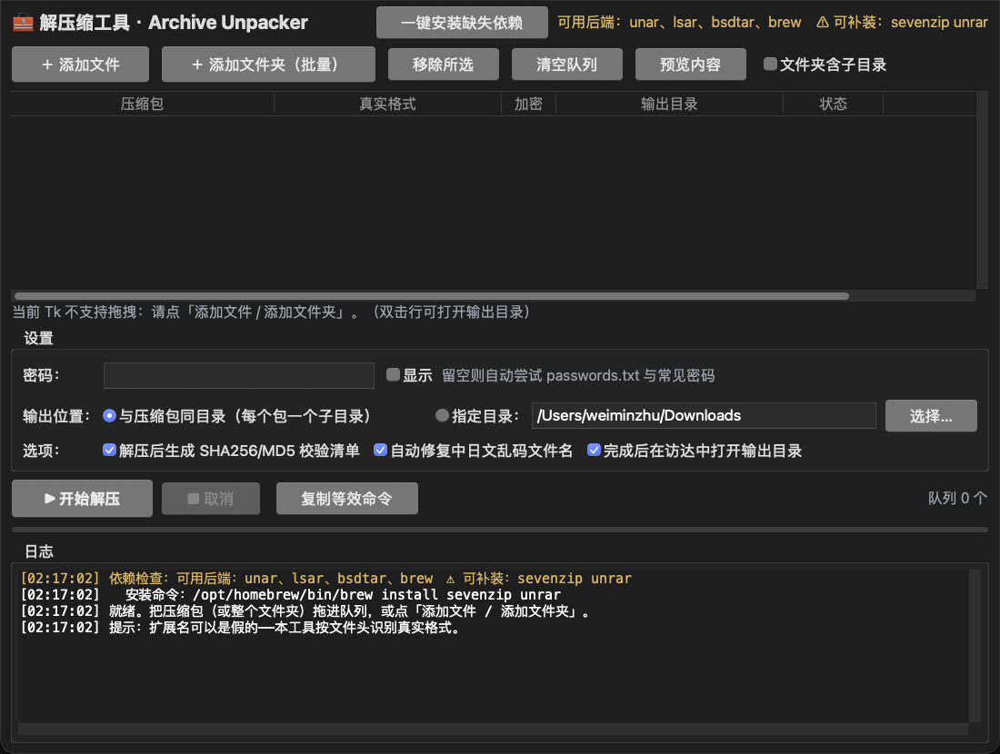
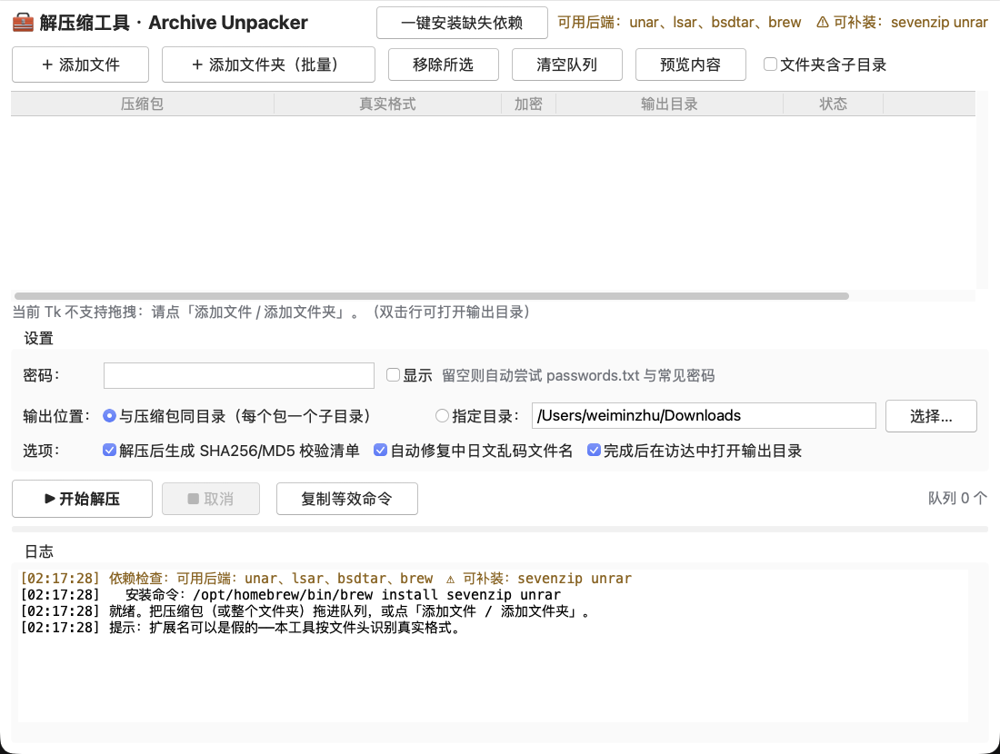

# 解压缩工具 · Archive Unpacker

[](LICENSE)


macOS 上的拖拽式解压缩工具。核心解决三件事：

1. **扩展名可以是假的** —— 按文件头魔数识别真实格式（`.7z` 实为 RAR5、`.rar` 实为 tar.gz 都能认）
2. **密码自动尝试** —— 界面填一个，或让它按 `passwords.txt` + 内置常见密码逐个试
3. **批量 + 可核验** —— 整个文件夹的包一次解完，每个包独立输出目录，并生成 SHA256/MD5 校验清单

> macOS 上两个已实测的坑，本工具都已绕开：
> - `unar` 解析 **PAX 扩展头**里的 UTF-8 文件名会变成 `??`（tar 系列交给 `bsdtar`）
> - 用 Python `tarfile` 造的包就是 PAX 头，解出来会乱码 —— 单元测试里专门盯着这条

---

## 界面

macOS 原生外观（aqua 主题 + 系统 UI 字体），浅色/深色自动跟随系统：

| 深色外观 | 浅色外观 |
| --- | --- |
|  |  |

## 快速开始

```bash
git clone https://github.com/zwm521gmailcom/mac-archive-unpacker.git
cd mac-archive-unpacker

# 仅需标准库；图形界面建议配好较新的 Tk（见下方「图形界面依赖」）
brew install python-tk@3.12        # 可选但推荐：Tk 9.1，系统自带的是 2009 年的 Tk 8.5

# 方式一：图形界面（访达里双击，或终端启动）
./启动解压缩工具.command

# 方式二：先自检环境（推荐首次运行）
python3 unpack_core.py
```

> 双击 `.command` 若提示没有执行权限，先执行一次：`chmod +x 启动解压缩工具.command`

### 图形界面怎么用

| 步骤 | 操作 |
| --- | --- |
| 1 | 把压缩包**拖到列表**上；或点「＋ 添加文件」/「＋ 添加文件夹（批量）」 |
| 2 | 加密包在「密码」里填密码（留空则自动试 `passwords.txt` 与内置常见密码） |
| 3 | 选输出位置：默认与压缩包同目录、每包一个子目录 |
| 4 | 点「▶ 开始解压」（快捷键 `⌘↩`） |
| 5 | 完成后看日志；双击某行可在访达里打开它的输出目录 |

其它按钮：

- **预览内容** —— 选中一个包，列出包内文件（加密包会报「需要密码」）
- **复制等效命令** —— 生成等价的 `unar` 命令行并复制到剪贴板，方便脚本化
- **一键安装缺失依赖** —— 缺 `unar` / `7zz` / `unrar` 时用 brew 补装
- **移除所选 / 清空队列** —— 管理队列
- **文件夹含子目录** —— 勾选后递归扫描子目录里的压缩包

---

## 命令行等价用法

图形界面只是壳，真正的逻辑在 `unpack_core.py`，可以直接当库用或照抄命令：

```bash
# 1) 看真实格式（unpack_core.py 的自检也会逐个探测后端）
python3 unpack_core.py

# 2) 直接命令行解压（unar 支持 RAR/RAR5/7z/ZIP 全格式 + 密码）
unar -f -D -o "/输出目录" -p "密码" "包.7z"     # -D 表示不额外套一层目录，-f 覆盖

# 3) tar 系列（含 .tar.gz/.tar.xz）建议用 bsdtar：
#    macOS 的 unar 解析 PAX 扩展头里的 UTF-8 文件名会变成 "??"
bsdtar -xf "包.tar.gz" -C "/输出目录"

# 4) 校验清单
cd "/输出目录"
shasum -a 256 -c .unpack-SHA256SUMS.txt
md5 -c .unpack-MD5SUMS.txt
```

---

## 文件说明

| 文件 | 作用 |
| --- | --- |
| `archive_unpacker_gui.py` | 图形界面（Tkinter，标准库，无需 pip 安装） |
| `unpack_core.py` | 核心逻辑：格式嗅探、后端调度、密码尝试、乱码修复、校验清单；`python3 unpack_core.py` 可自检 |
| `启动解压缩工具.command` | 双击启动器（自动挑选带 Tk 的 Python） |
| `passwords.txt` | 可选：常用密码本，一行一个，`#` 开头为注释 |
| `test_unpack.py` | 单元测试（56 项）：嗅探/批量/解压/密码/乱码/清单/命名/错误处理 |
| `make_test_archives.py` | 造测试包：UTF-8 名 zip、乱码 zip、加密 zip、tar.gz、伪扩展名包等 |
| `smoke_gui.py` | 无人值守 GUI 冒烟测试（可真正跑一遍批量解压） |

---

## 支持的格式与后端

| 格式 | 首选后端 | 备用后端 |
| --- | --- | --- |
| RAR / RAR5 | `unar` | `7zz`、`unrar` |
| 7z | `unar` | `7zz` |
| ZIP | `unar` | `7zz`、`bsdtar`、Python `zipfile` |
| TAR / TAR.GZ / TAR.BZ2 / TAR.XZ / TAR.ZST | `bsdtar` | `unar`、Python `tarfile` |
| CAB / ARJ / GZIP / BZIP2 / XZ / ZSTD / ISO | `unar` | `7zz` |

依赖安装：

```bash
brew install unar sevenzip unrar libarchive   # unar 是主力，其余为备用
```

`bsdtar` 通常系统自带（`/usr/bin/bsdtar`）；本工具也会去 miniconda 等目录里找。

---

## 行为约定（安全相关）

- **绝不覆盖已有内容**：输出目录已存在且非空时，自动改用 `名字 (2)`、`名字 (3)`
- **同批也不会撞车**：`归档.tar.gz` 与 `归档.tar.bz2` 推导出的目录名相同，队列里会自动让后者变成 `归档 (2)`
- **不删除任何原始压缩包**
- **解密失败自动清场**：密码全错时，后端可能写下垃圾/半截文件，工具会把这些残留清掉，不留半成品
- **密码来源顺序**：界面填的 → `passwords.txt` → 内置常见密码（如 `oldmanemu.net`、`123456`），逐个尝试
- **空间预检**：目标磁盘剩余空间不足（按压缩包的 1.2 倍估算）时跳过并提示
- **校验清单可回验**：`.unpack-SHA256SUMS.txt` / `.unpack-MD5SUMS.txt` 用系统 `shasum -c` / `md5 -c` 即可复核
- 超过 8 GB 的包默认只统计不逐个哈希（可在代码里调 `verify_and_manifest` 的 `max_total_bytes`）

### 关于中文/日文文件名

- 正常 UTF-8 名（含 ZIP 的 UTF-8 标志位）直接正确解出
- **乱码修复**：历史上有些 ZIP 把 UTF-8 文件名按 CP437 存，解出来是 `µùѵ£¼...` 这类乱码。
  工具会自动识别（判据：原名无 CJK、按 CP437 还原后能解出 CJK），并尝试 UTF-8 / Shift-JIS / GBK / Big5 还原，
  且做 NFC 规范化以适配 macOS 文件系统的分解式 Unicode
- 勾选「自动修复中日文乱码文件名」即可；不改名的预览也可通过 `unpack_core.fix_mojibake_tree(..., dry_run=True)` 查看

---

## 图形界面依赖（重要，踩过坑）

**请用 Tk 8.6 以上的 Python 运行图形界面**，启动器已自动优先挑选：

```bash
brew install python-tk@3.12      # 装完得到 Tk 9.1，启动器会优先用它
```

| | 表现 |
| --- | --- |
| Tk 8.6+（如 Homebrew python3.12 的 Tk 9.1） | 正常，深/浅色都清晰 |
| 系统自带 Tk 8.5（`/usr/bin/python3`，2009 年） | **在 macOS 26/27 上会「文字与背景同色、控件画不出来」**，整窗近乎空白 |

已实测确认 Tk 8.5 的两个毛病：默认主题下文字与背景同色（信息全看不见）、
`pack(expand=True)` 把日志区挤成 4 像素高。工具已改为 grid 权重布局避免后者，
但前者只能靠换 Tk —— 所以启动器不再优先选系统 Python。

界面按 **macOS 系统风格**呈现：

- 主题用系统原生 `aqua`，控件外观（按钮圆角、单选/复选框、滚动条）全部由 macOS 绘制
- 字体用系统 UI 字体 `.AppleSystemUIFont`（正文 13pt、标题 16pt、等宽 Menlo 11pt）
- 颜色用 macOS 语义色：`systemWindowBackgroundColor`、`systemTextColor`、
  `systemSelectedTextBackgroundColor` —— 因此**浅色/深色外观自动跟随系统**，程序不自己画配色
- 仅日志的状态色（成功/警告/错误/信息）是自定义的，并按外观给深浅两套高对比版本
- 可用 `python3 archive_unpacker_gui.py --checkstyle` 自检：打印主题、外观、字体与对比度
- 启动后主动 `lift()` + `focus_force()`；启动器也会先激活终端
  （未被激活的 Tk 窗口可能只画出部分控件，点一下才全部重绘）

其它调试开关：

```bash
python3 archive_unpacker_gui.py --checkstyle   # 配色对比度自检
python3 archive_unpacker_gui.py --geom         # 打印所有控件的实际几何（排查布局）
python3 archive_unpacker_gui.py --shot 出图.png 3   # 自截图（需授予「屏幕录制」权限）
```

## 测试

```bash
python3 test_unpack.py                       # 56 项单元测试，无需人工
python3 smoke_gui.py                         # 建界面 + 渲染自检（2.5 秒后退出）
python3 smoke_gui.py 包.rar 密码 /tmp/out     # 真跑一遍批量解压（含校验清单）
python3 make_test_archives.py /tmp/fixtures  # 造一批测试包
python3 tk_probe.py                          # Tk 渲染对照实验（排查「窗口空白」）
python3 ui_shot_check.py                     # 截取真实窗口 + 像素分析（外观自动验收）
```

`ui_shot_check.py` 会启动界面、用 `screencapture` 抓真实窗口、再逐横带统计内容像素，
输出 `ui_shot.png` 供人眼复核。它需要「屏幕录制」权限；权限被拒会明确报错而不是静默通过。

`test_unpack.py` 会覆盖这些回归点（都是真实踩过的坑）：

- 伪扩展名识别（`.7z` 是 zip、`.rar` 是 tar.gz）
- 目录批量发现与递归、去重、排除非压缩包
- 解压后**不**多套一层目录（`unar -D` 语义）
- Python `tarfile` 造的 PAX 头 + 日文名不乱码（必须走 `bsdtar`）
- 乱码 zip 的检测与还原、正常中日文名不误判
- 多密码依次尝试、全错时报错清晰、失败后不留残留
- SHA256/MD5 清单与独立复算一致

---

## 已知限制

- **图形界面拖拽**：macOS 系统自带的 Tk 8.5 对拖放支持有限。工具会优先启用 macOS 原生
  `OpenDocument` 拖放，失败则退到 Tk 内置 dnd；两者都不支持时，用「添加文件 / 添加文件夹」按钮
  （功能完全一致）。想要更现代的控件与更顺的拖拽体验，建议 `brew install python-tk`，
  启动器会自动优先使用 Homebrew 的 Python。
- **Tk 8.5 请勿用于图形界面**：除了上面说的配色/铺版问题，在 macOS 26/27 上
  `root.update()` 这类直接驱动事件循环的调用还可能卡死（`mainloop()` 正常）。
  本工具界面代码不使用 `update()`；`smoke_gui.py` 也用 `after()` 钩子而非 `update()` 轮询。
- **界面尺寸**：默认 1100×830；队列区与日志区按 3:1 分享纵向空间，最小高度分别为
  240 / 170 像素，窗口再小也不会把日志框挤没（这条有回归测试盯着）。
- **加密的 7z / RAR** 需要 `unar`（或 `7zz`/`unrar`）后端，Python 内置库无法处理。
- **多卷压缩包**（`.part1.rar`、`.7z.001`）：需要把同批分卷放在一起，用 `unar` 指定第一卷；
  图形界面暂未做分卷自动合并。
- 只读文件系统、无权限目录会直接报错，不做提权。

---

## License

[MIT](LICENSE) © 2026 zwm521gmailcom
